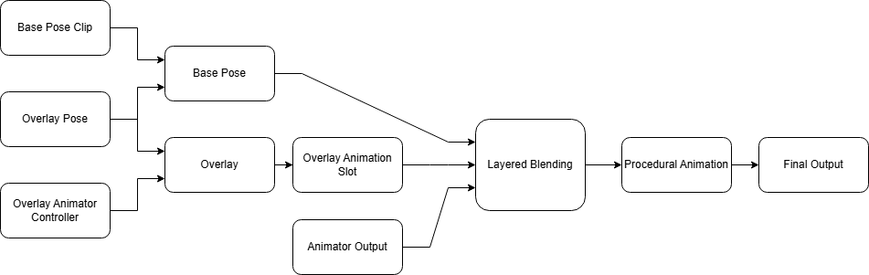

# Omni Character
This is the creation of a drag and drop ready character animation system.

## MAIN PILLARS OF DESIGN!!!

- easy to use
- extensible
	- modular
	- bring own animations
- Gameplay actions to drive animations as automatically as possible

## impl design
- Omni Character is a node. It inherits characterController3d
	- I want to be configured from one screen or node.
	- Can contain multiple types of resources

- built upon Input State -> tag set, resolver (what clip(s) to play) and composition (stack multiple actions in layers -> Final pose

### DATA
 - AnimationClips/BlendSpaces
	 - Contain tag data
		- For blendspaces needs scalar bindings
 - layers
 - Tags: data about the character such as equiped weapon, active action, status, locomotion. must be based descrete and not continuous data.
 - Rules:
	 - Checks that can prevent an animationClip from being selected acts as a filter
 - Ability actions:
	 - are gameplay based things the player can do
	 - can have multiple actions occuring at same time ex: walking and shooting
		- return tags and state data
 - style:
	 - affects how actions look (like injured, breathing) has no affect on actual gameplay

### Design Problems:
 - incompatible actions?? actions that affect the same bone?? swimming affects leg bones and so does running???
 	- possible fix is some kind of rule table
  - Rules contain some boolean statement based off character current actions??
- How would a shooting action work with different weapons?
	- makes me think there needs to be a layer above "actions"
	- Actions no longer return direct animation clips. It now adds and removes tags and state data. The resolver uses this to select the clip.
- How does the resolver work?
	- Uses the tags on the clips to choose best match
	- Might be cumbersome to make the correct anim to choose in the right scenerio.
#### Scenario 1:
 Input: W key

Camera Vector: Forward

global_movement_vector: Foward

 ---
 World/Character state: Grounded,

 External forces: none

 Style options : none

 prev_state: same

----

Available actions:

Walk, Run, jump, swim, shoot, hold item, pickup item,

Selected actions based on Input and prev_state: Walk

Walk clips: Walk_F Walk_R Walk_L Walk_Bkwd

Action selectes script based on global_movement_vector calcualted by input and camera vector.

Resolution: Walk_F -> Walk_F or continues in this case

#### Scenario 2: change direction from forward to foward left

Input: W and A key

Camera Vector: Forward

global_movement_vector: Foward_LEFT

 ---
 World/Character state: Grounded,

 External forces: none

 Style options : none

 prev_state: FOWARD, WALK_F

----

Available actions:

Walk, Run, jump, swim, shoot, hold item, pickup item,

Selected actions based on Input and prev_state: Walk

Walk clips: Walk_F Walk_R Walk_L Walk_Bkwd

Action selectes script based on global_movement_vector calcualted by input and camera vector.

Resolution: Walk_F -> Walk_F + Walk_L blended

#### Scenario 3: change direction and start shooting

Input: W and A key, Left Click

Camera Vector: Forward

global_movement_vector: Foward_LEFT

 ---
 World/Character state: Grounded,

 External forces: none

 Style options : none

 prev_state: FOWARD, WALK_F

----

Available actions:

Walk, Run, jump, swim, shoot, hold item, pickup item,

Selected actions based on Input and prev_state: Walk, shoot

Walk clips: Walk_F Walk_R Walk_L Walk_Bkwd
Shoot Clips: no_shoot, begin_shoot (pull out gun type animation), Shoot, end_shoot

Walk Action selectes a clip based on global_movement_vector calcualted by input and camera vector.
Shoot action selectes a clip based on prev shoot state
Resolution: Walk_F -> Walk_F + Walk_L blended, no_shoot -> begin_shoot

### outside character data
	- Raycasts results
	- Input
	- Forces

Character basics -> results of everything proccesed:
- Transform3d
- current animation(s)
Derived from:
- Controller Input
- World State
		-	World Gives you:
			- collision
			- gravity
			- velocity
- Game Data:
	- game rules (can you jump?)

can we??:
Fn(Controller_Input, World_state, game_rules) -> Character_STATE

### Pack Interface:


### Ability interface

#### Props:
- ID
- Layers: Animation clips
- Rules
- Bindings
	- example: scalar bindings for blendspaces.

# PURE SCRATCHPAD OF Q&A

Gameplay is defined by:
- global movement


## What is state?
 - A described set of set values????
  - External state:
	  - external forces ex: Enemies hitting/touching you, gravity
		-
  - Internal state:

  ## Seperate Global Movement from actions?:


## What does an action actually do????:
 - Narrow down the exact clips to play and bones to affect


# godot-cpp template
This repository serves as a quickstart template for GDExtension development with Godot 4.0+.

## Contents
* Preconfigured source files for C++ development of the GDExtension ([src/](./src/))
* An empty Godot project in [project/](./project), to test the GDExtension
* godot-cpp as a submodule (`godot-cpp/`)
* GitHub Issues template ([.github/ISSUE_TEMPLATE.yml](./.github/ISSUE_TEMPLATE.yml))
* GitHub CI/CD workflows to publish your library packages when creating a release ([.github/workflows/builds.yml](./.github/workflows/builds.yml))
* An SConstruct file with various functions, such as boilerplate for [Adding documentation](https://docs.godotengine.org/en/stable/tutorials/scripting/cpp/gdextension_docs_system.html)

## Usage - Template

To use this template, log in to GitHub and click the green "Use this template" button at the top of the repository page. This will let you create a copy of this repository with a clean git history.

To get started with your new GDExtension, do the following:

* clone your repository to your local computer
* initialize the godot-cpp git submodule via `git submodule update --init`
* change the name of the compiled library file inside the [SConstruct](./SConstruct) file by modifying the `libname` string.
  * change the paths of the to be loaded library name inside the [project/bin/example.gdextension](./project/bin/example.gdextension) file, by replacing `EXTENSION-NAME` with the name you chose for `libname`.
* change the `entry_symbol` string inside [project/bin/example.gdextension](./project/bin/example.gdextension) file.
  * rename the `example_library_init` function in [src/register_types.cpp](./src/register_types.cpp) to the same name you chose for `entry_symbol`.
* change the name of the `project/bin/example.gdextension` file

Now, you can build the project with the following command:

```shell
scons
```

If the build command worked, you can test it with the [project](./project) project. Import it into Godot, open it, and launch the main scene. You should see it print the following line in the console:

```
Type: 24
```

### Configuring an IDE
You can develop your own extension with any text editor and by invoking scons on the command line, but if you want to work with an IDE (Integrated Development Environment), you can use a compilation database file called `compile_commands.json`. Most IDEs should automatically identify this file, and self-configure appropriately.
To generate the database file, you can run one of the following commands in the project root directory:
```shell
# Generate compile_commands.json while compiling
scons compiledb=yes

# Generate compile_commands.json without compiling
scons compiledb=yes compile_commands.json
```

## Usage - Actions

This repository comes with continuous integration (CI) through a GitHub action that tests building the GDExtension.
It triggers automatically for each pushed change. You can find and edit it in [builds.yml](.github/workflows/ci.yml).

There is also a workflow ([make_build.yml](.github/workflows/make_build.yml)) that builds the GDExtension for all supported platforms that you can use to create releases.
You can trigger this workflow manually from the `Actions` tab on GitHub.
After it is complete, you can find the file `godot-cpp-template.zip` in the `Artifacts` section of the workflow run.
